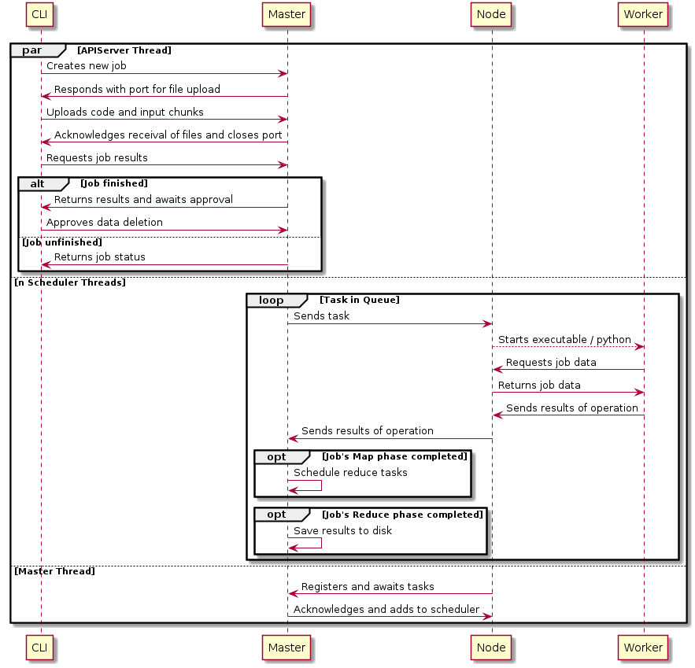
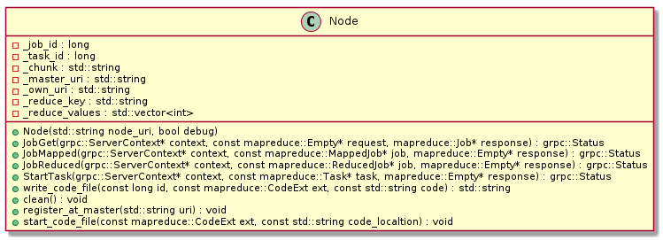
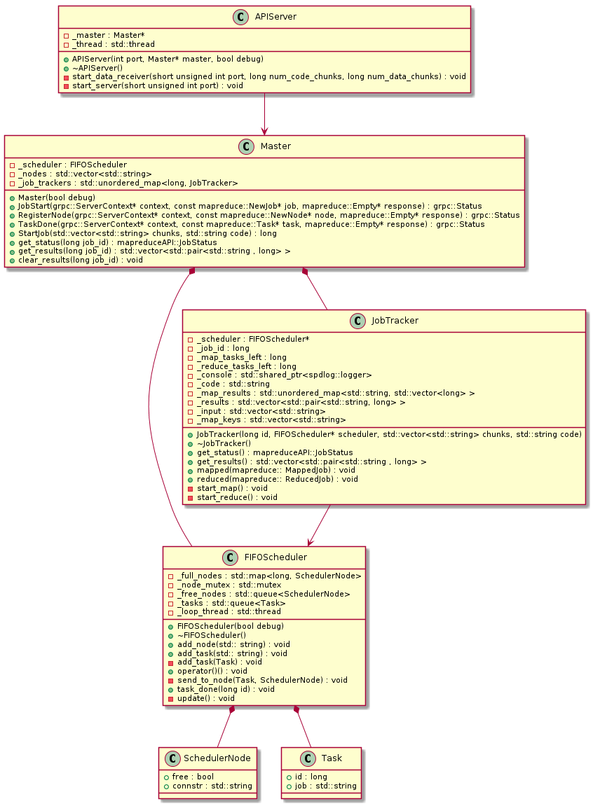

# Introduction

MapReduce is an algorithm for distributed, parallel processing of data. It accomplishes this, by dividing up the input data into chunks and processing these chunks in several stages. The following graphic depicts these stages and shows what input and output are needed / provieded ny each stage.


## Stage 1: Splitting

The main goal of this stage, is to split up the input data into chunks, hence the name "Splitting". This can be accomplished in several ways. A common approach (and the approach used in this project) is to split at the end of each line. This is rather simple, however results in an increased amount of chunks, that have to be processed. Another apprach, which is used by the popular big data processing software "Hadoop" is to split the data into block of 64MB.

In this implementation, the splitting phase is realised on the client's computer, or to be more precise, in the command line interface (CLI). Data is first ingested by this cli, then splitted and finally uploaded in chunks to the master. This is primarily due to simplicity reasons.

## Stage 2: Mapping

In it's core, this phase is quite simple: It takes input data, processes it using whatever algorithm the user intends to use and returns a list of key-value pairs - for example [(Foo, 2), (Bar, 1)].

This implementation realises the map phase, by distributing so called "jobs" to each node. A job contains a python script and the data, that needs processing. Each node writes the code to this and executes it using python3. Obviousely, this is a security risk, because running unveried code on some random machine in some data center is inherently flawed, however for reasons of simplicity in the implementation this approach was choosen.

## Stage 3: Shuffling

The purpose of this stage is to organise the key-value pairs generated by mapping stage and grouping them by key. Each group is then independently sent to a node. In reality this stage is very complicated, because the cost of transferring data is high and in an optimal case, this should be minimized.

## Stage 4: Reduce

This phase ingests the groups of data generated and applies some form of user-specified algorithm to it - in the end, the result is exactly one key-value pair for each group. These pairs are then accumalated and stored on the disk, for the user to retrieve and utilize.

# Software Architecture 

## Communication / Lifecycle



This section will explain the cummunication diagram chronologically, starting at the first user input to the cli.


The first step for a user is to create a new job. This is achived, by writing a "job.json" file, as described in Section 3.1 and provide the input and this configuration file to the CLI. The CLI then goes ahead and communicates to the master, that it wishes to upload data. For the sake of minimizing impact on other user, the approach has been chosen to then open a new, sperate port on the master to receive data on. After data upload has finished, this data is ingested by the master and eventually scheduled for mapping on a Node.

Once a new node is created on the network, it registeres with the master and thus is ready to be included in task scheduling.

Each time a new task is sent to the node, the code of that particular task is written to a temporary space on the disk and executed, a new Worker has been created. This worker then goes ahead and retrives the job and it's associated data from the node, processes it and sends it back to the master, via the node.

Eventually all map task are completed, at this point the master shuffles, sorts and groups the data, to then schedule new reduce tasks. The results of this phase are stored to the disk, to be later retrieved by the user.

## Components

### Node

In comparison to the master, a node is relatively simple. A node is only able to process exactly one task at a time, however that can be multiple nodes for each computer. Optimally, the number of nodes is equal to the number of CPU cores. 



### Master

In the diagram, the master is the central component. The APIServer is responsible of ingesting data from the CLIs, processing it and then sending it off to the master. The FIFOScheduler takes care of scheduling map and reduce jobs on all nodes - in this case FIFO stands for "First in first out", which means that in essence the tasks are put into a queue.



### CLI

Because of size and complexity, the CLI has not been structured in an object-oriented manner. It is relatively straight-forward with nearly no logic involved.

# Usage guide

## For End-users

### Python API

The python API for writing MapReduce algorithms should be mostly self-explainatory, however here is one example to count word occurances.

```python
  import Worker

  def map_func(chunk):
      results = []

      for word in str(chunk).split(' '):
          results.append([word, 1])

      return results


  def reduce_func(key, values):
      return sum(values)


  worker = Worker(map_func, reduce_func)
```
### CLI

For interacting with the MapReduce system, a clean and easby command line interface is provided. To start a job, first of all, a job configuration file aka. job.json has to be created. It has to follow the following schema:

```json
{
  "input": "shakespeare.txt", // Relative path to the input file
  "split": "line", // Alogirthm used for splitting the input into chunks. 
                   // Current only linewise splitting is supported.
  "code": "impl.py", // Relative path to the python 
  "ip": "127.0.0.1", // Master IP
  "port": "3000" // Master Port
}
``` 

Next, the cli needs to do it's magic. Just use ` ./cli start --config job.json` to start a new job. Wait a little while, get a coffe and call `./cli status --id <job_id>` to retrieve either the results, or the current status of the job. That's it!

## For System Administrators

Start one master by using `./master` - there are command line parameters provided to change the Master and API ports.
Start nodes by using `./node`, master IP and Port can be specified on the command line.